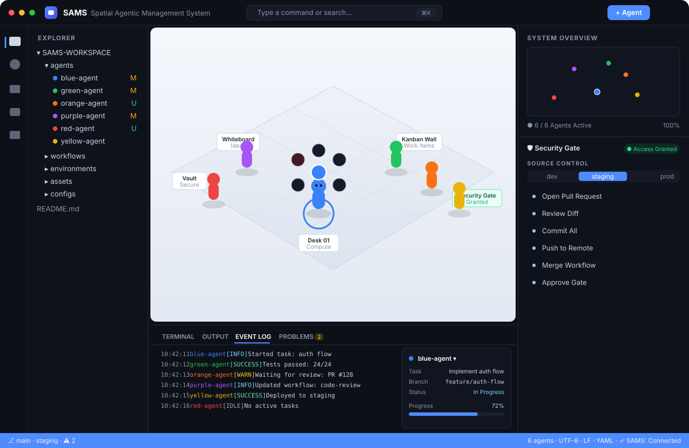

# SAMS · Spatial Agentic Management System

> **The Sims, but for managing AI agents.** A 3D, game-like workspace where each
> AI agent is a little character you can spawn, select, walk around an office and
> assign work to — wrapped in a familiar IDE-style shell.

This is **v1: a manual sandbox**. You are in control — spawn agents, click to
select them, send them walking across the floor, dispatch them to zones
(Desk, Whiteboard, Kanban Wall, Vault, Security Gate, Lounge) and assign tasks.
Everything you do streams into a live Event Log.



## Stack

- **React + TypeScript + Vite**
- **three.js** via **@react-three/fiber** + **@react-three/drei** for the 3D scene
- **Zustand** for state (agents, tasks, events, UI)
- **Tailwind CSS** for the IDE shell
- **lucide-react** for icons

## Getting started

```bash
npm install
npm run dev      # http://localhost:5173
```

Other scripts:

```bash
npm run build    # type-check (tsc) + production build
npm run preview  # serve the production build
```

> A modern browser with **WebGL** is required for the 3D scene.

## What you can do

| Action | How |
| --- | --- |
| Spawn an agent | **+ Agent** button (top bar) or `⌘/Ctrl + K` → *Spawn agent* |
| Select an agent | Click it in the scene, the **System Overview** minimap, or the Explorer |
| Walk an agent | Select it, then **click the floor** where you want it to go |
| Dispatch to a zone | Click a zone ring in the scene, use the **radial menu**, the **Spatial CAD** panel, or the inspector's *Send to…* |
| Assign / update a task | Use the **Agent inspector** (bottom-right): title + branch, then drag the progress slider |
| Set status | Radial menu around a selected agent, or the inspector's status buttons |
| Remove an agent | Radial menu (trash) or the inspector |
| Source-control actions | The **Security Gate** panel (right): open PR, commit, push, approve… (streamed to the Event Log) |
| Command everything | `⌘/Ctrl + K` command palette |

## Layout (mirrors the reference design)

```
┌───────────────────────────────────────────────────────────┐
│ TitleBar — brand · command search (⌘K) · panel toggles     │
├──┬───────────┬─────────────────────────────┬───────────────┤
│A │ Explorer  │                             │ System Overview│
│c │ /Search   │      3D OFFICE SCENE         │  (minimap)     │
│t │ /SCM      │   agents · zones · radial    ├───────────────┤
│B │ /CAD      │      menu · click-to-walk    │ Security Gate  │
│a │ /Exts     │                             │ Source Control │
│r │           ├─────────────────────────────┤  actions       │
│  │           │ Terminal·Output·Event Log·Pb │ Agent Inspector│
├──┴───────────┴─────────────────────────────┴───────────────┤
│ StatusBar — branch · env · warnings · agents · Connected    │
└───────────────────────────────────────────────────────────┘
```

## Project structure

```
src/
  data/        world layout (room + zones) and seed agents/events/file-tree
  scene/       react-three-fiber scene
    OfficeScene.tsx   canvas, camera, lights, floor, walls, zones, agents
    Agent3D.tsx       a "Sims-like" character: walking, selection, radial menu
    Furniture.tsx     desk, whiteboard, kanban, vault, gate, sofa, plant
    RadialMenu.tsx    the in-world pie menu
  components/   IDE shell (TitleBar, ActivityBar, panels, BottomPanel, …)
  store/        Zustand store — the heart of the sandbox
  lib/          small utils + shared UI metadata
  types.ts      domain model
```

## Roadmap ideas

- **Live simulation mode** — agents that pick up tasks and progress on their own.
- **Real agent integration** — the store already isolates the data layer, so an
  agent's task/status/progress could be driven by a real backend (e.g. the
  Claude API) instead of manual input.
- Persistence (save/load workspaces), multi-room layouts, drag-to-move,
  richer character models, and a true resizable panel system.

---

*Italiano:* SAMS è un "The Sims" per gli agenti AI — un ufficio 3D dove crei,
selezioni e comandi gli agenti dentro una shell in stile IDE. Questa è la v1
**sandbox manuale**: sei tu a guidare tutto.
