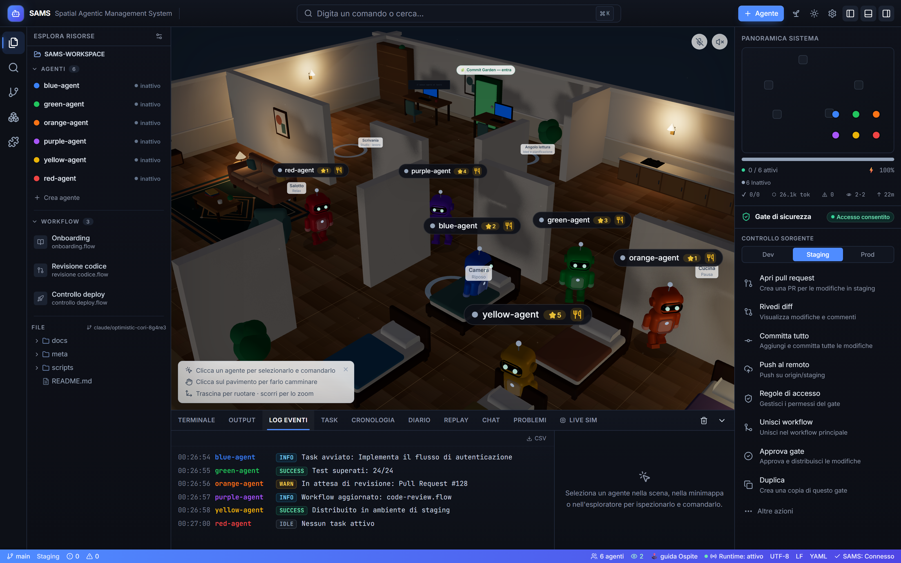

# SAMS · Spatial Agentic Management System

> **The Sims, but for managing AI agents.** A 3D, game-like workspace where every
> AI agent is a little character you spawn, select, walk around a room and assign
> work to — wrapped in a familiar IDE-style shell. Now **multiplayer**: several
> people, each with a real account, share the same live room.

Assign a task in plain language and — in **live mode** — the agent mounts your
GitHub repo, does the work in a sandbox, pushes a branch and opens a pull request,
streaming its status, progress and logs into the 3D scene. Watch teammates'
cursors, selections and edits in real time, chat next to the scene, and see
**which person** started and finished every task.



---

## Contents

- [Quick start](#quick-start)
- [What you can do](#what-you-can-do) — the full feature tour
  - [1 · The 3D room & the agents](#1--the-3d-room--the-agents)
  - [2 · Assigning & tracking work](#2--assigning--tracking-work)
  - [3 · Real AI agents (live mode)](#3--real-ai-agents-live-mode)
  - [4 · Automation & reactivity](#4--automation--reactivity)
  - [5 · Multiplayer & accounts](#5--multiplayer--accounts)
  - [6 · Observability & sharing](#6--observability--sharing)
  - [7 · The shell & quality-of-life](#7--the-shell--quality-of-life)
- [How to use it](#how-to-use-it) — step by step
- [Keyboard & actions](#keyboard--actions)
- [Layout](#layout)
- [Stack & project structure](#stack--project-structure)
- [Development](#development)
- [Deploy](#deploy)
- [Roadmap](#roadmap)

---

## Quick start

```bash
npm install
npm run dev            # http://localhost:5173  (frontend only — everything works in a manual sandbox)
```

Want **real** agents that open PRs, plus the shared multiplayer runtime?

```bash
npm run bootstrap      # install web + server deps (once)
npm start              # launch the app AND the runtime together (scripts/dev-all.mjs)
```

Then open **http://localhost:5173** — the welcome site is at `/`, the 3D workspace
at `/app`. A modern browser with **WebGL** is required for the 3D scene.

> No keys, no accounts? SAMS still runs as a fully-featured **manual sandbox** and
> in **open dev mode** every action is allowed. Add keys/accounts to unlock live
> agents and role-based multiplayer.

---

## What you can do

### 1 · The 3D room & the agents

Each agent is a colored character living in a cozy 3D room.

- **Spawn / remove agents** — the **+ Agent** button (top bar) or `⌘/Ctrl + K → Spawn agent`; remove via the radial menu or the inspector.
- **Select** — click an agent in the scene, the **System Overview** minimap, or the Explorer list.
- **Walk** — select an agent, then **click the floor** to send it there. **Drag** to orbit the camera, **scroll** to zoom.
- **Dispatch to a zone** — click a zone ring or use the radial menu / inspector *Send to…*. Zones: **Scrivania** (desk · work), **Angolo lettura** (ideas & planning), **Cucina** (break), **Salotto** (lounge), **Camera** (rest), plus the **🌿 Commit Garden** door.
- **Radial menu** — a pie menu around a selected agent for quick status, send-to and remove actions.
- **Needs, energy & mood** — à la The Sims, agents have **energy** (drains on long tasks, recovers when idle) and **hunger** (assigning a task "feeds" them). Their **mood** reacts to outcomes, energy and hunger. Keeping agents busy keeps them fed.
- **XP & skill tree** — every completed task grants XP; agents level up (the ⭐ badge over each character) and climb a rank/skill tree.
- **Rearrange the furniture** — enter reorder mode and **freely drag** the furniture to lay out the room the way you like (layout is saved locally).

### 2 · Assigning & tracking work

- **Assign a task** — in the **Agent inspector** (bottom-right): a title + branch, then drag the progress slider (manual mode), or type a task in plain language and hit **Assign task (live)**.
- **Task queue** — hand an agent several tasks; they run FIFO when it's free, and **urgent** tasks jump the queue.
- **Set status** — `idle · working · review · blocked · done · awaiting_approval` from the radial menu or the inspector.
- **Tasks panel** — a live history of assigned tasks with status, progress, result links (PR/Notion), token usage — and **who assigned/completed each one**.
- **Per-user attribution** — every task remembers the person who started it; it shows in the Tasks panel, the Event Log and the completion toast, so in a shared room you always know *who* did what.

### 3 · Real AI agents (live mode)

SAMS can drive **real** AI agents that actually change your repo — all from inside
the app (the only terminal command is a single `npm start`).

- **Pick a provider** (⚙ Runtime settings):
  - **Gemini** (Google, free tier) — default; free key at <https://aistudio.google.com/apikey>.
  - **Groq** (Llama 3.3 70B, free) — free key at <https://console.groq.com>.
  - **OpenRouter** (`:free` tool-capable models, free) — free key at <https://openrouter.ai/keys>.
  - **Claude** (Anthropic, paid) — needs API credits; click *Provisiona agenti*.
- **What an agent does with a task** — mounts your GitHub repo, works in a sandbox, creates a branch, commits, and (optionally) opens a **pull request** — with status/progress/logs streamed live into the scene.
- **Repo-agnostic** — change the **Repository** field to point agents at any repo; overridable per-agent.
- **Diff preview + approval gate** — optionally stage changes for review before they're committed (`SAMS_REQUIRE_APPROVAL`).
- **Notion** — with a Notion token, agents can write into a **page by title** (e.g. *"red-agent: add an async/await example to the JAVASCRIPT page"*).
- **MCP tools** — through one generic `mcp_call(server, tool, args)` tool, agents can reach external **MCP servers** (Google Drive, Calendar, Canva, …). It's an **allow-list** configured via `SAMS_MCP_SERVERS`; nothing is exposed unless you enable it.

### 4 · Automation & reactivity

- **Live Sim** — flip it on and idle agents autonomously pick up **GitHub issues** (filtered by label, default `sams`) and work them.
- **Incoming GitHub webhooks** — SAMS *reacts* to your repo:
  - **push / PR opened·closed·merged** → a summary line in the Event Log (and a watered plant in the Commit Garden).
  - **CI failed** (`workflow_run`) → a 🔔 *wake*: a contextual "investigate & fix the CI on branch X" task.
  - **review requested** → a 🔔 *wake*: a review task for that PR.
  - Auto-assignment of wakes is opt-in (the *Rispondi ai webhook GitHub* toggle). Always set `GITHUB_WEBHOOK_SECRET` when the runtime is on the internet — the endpoint HMAC-verifies GitHub's signature and rejects forgeries.
- **Routines** — recurring scheduled tasks ("every morning: summarize open PRs to Notion"). They live in the runtime (SQLite), survive restarts, and a scheduler tick assigns them to a free agent when due.
- **Chain reactions & a proactive meta-agent** — agents can hand off work to each other, and a self-improving **meta-agent** proposes improvements to SAMS itself (PRs against the SAMS repo).

### 5 · Multiplayer & accounts

SAMS is a **shared product**, not a single-player demo. Several people can operate
the **same room at the same time**.

- **Real accounts** — email + password, hashed with scrypt (no native deps), with opaque **bearer-token sessions** in SQLite. The *first* account to register becomes **owner**.
- **Roles / permissions** — `owner > editor > viewer`. Owners manage settings, secrets and other users' roles; editors assign/approve work, run the sim and chat; viewers watch (and can open the public dashboard). Every mutating route is guarded server-side, and the UI hides what your role can't do. Your logged-in session governs your workspace role automatically.
- **Live presence** — a roster of **who's watching**, Figma-style **cursors** on the floor, and **selection auras** showing which agent a teammate has picked — everyone under their **real account name**.
- **Shared, authoritative world** — the roster of agents + their tasks is a **versioned server state** (SQLite). Edits reconcile to every view over **SSE** with optimistic concurrency (compare-and-swap), and a **driver lease** elects one view to simulate movement so agents animate consistently for everyone.
- **Workspace chat** — a human-to-human channel next to the scene, live for everyone in the same room.

> Run without any tokens/accounts and SAMS stays in **open dev mode** — every
> request is treated as `owner`, exactly like the original single-user sandbox.

### 6 · Observability & sharing

- **Event Log** — every action streams here live (color-coded per agent, INFO/SUCCESS/WARN/ERROR/IDLE), exportable to CSV.
- **Metrics, history & world diary** — task stats, a timeline, and a narrated "diary" of what happened in the world.
- **Replay & OG image** — replay a session; generate a shareable social preview.
- **Public dashboard** — open `?public` (e.g. `http://localhost:5173/?public`) for a **read-only** dashboard (runtime status, task metrics, Commit Garden leaderboard) with **no** controls. Gate it with `SAMS_READONLY_TOKEN` + `&token=…`.
- **Commit Garden** — a 🌿 door in the room opens a virtual garden where every GitHub **push waters a plant** that grows (seed → sprout → … → blooming), with per-user profile pages at `/u/:user`. It's built into the runtime; with the webhook connected, pushes auto-water in real time.

### 7 · The shell & quality-of-life

- **Command palette** — `⌘/Ctrl + K` runs everything by name.
- **Explorer** — real repo file tree (via GitHub), agent list, workflows/playbooks.
- **Terminal, Output, Problems** panels alongside the Event Log.
- **Installable PWA** — from a production build the browser offers **Install**; SAMS runs in its own window and the app shell works **offline** (the service worker never touches the live `/api/**` stream, so real-time keeps flowing).
- **Themes, sounds & narration** — light/dark theme toggle, optional sound effects and a narration voice for events.
- **Onboarding & tour** — a first-run wizard explains the concepts and a UI tour shows where things live.

---

## How to use it

**A. Just play (manual sandbox) — 30 seconds**

1. `npm run dev` → open `http://localhost:5173/app`.
2. **+ Agent** to spawn a character, click it to select, click the floor to walk it around.
3. Open the **Agent inspector**, give it a task title, drag the progress slider. Watch the Event Log.

**B. Go live (real PRs) — a few minutes**

1. `npm run bootstrap` then `npm start`.
2. In the app, click **⚙** → choose a provider and paste its key.
3. Paste a **GitHub token** (fine-grained, *Contents: Read and write*), set the **Repository**, optionally a **Notion** token → **Save**.
4. Select an agent, type a task in plain language, **Assign task (live)** → watch the branch and PR appear.

**C. Invite teammates (multiplayer)**

1. Deploy the runtime (see [Deploy](#deploy)) or expose your local one.
2. Each person opens the site and **registers** (first user = owner). The owner sets roles in **user management**.
3. Everyone lands in the same `/app` room — cursors, selections, chat and task attribution are live and per-person.

**D. Automate it**

- Turn on **Live Sim** to let agents pull GitHub issues, add a **webhook** so SAMS reacts to CI/PRs, and create **Routines** for recurring work.

Keys and provisioned IDs are stored locally in `server/.sams-runtime.json`
(git-ignored). The app talks to the runtime at `http://localhost:8787` by default
(override with `VITE_SAMS_BACKEND_URL`). Full runtime guide: [`server/README.md`](./server/README.md).

---

## Keyboard & actions

| Action | How |
| --- | --- |
| Command palette | `⌘/Ctrl + K` |
| Spawn an agent | **+ Agent** or palette → *Spawn agent* |
| Select / cycle agents | Click, or `Tab` / `Shift+Tab` |
| Deselect | `Esc` |
| Walk an agent | Select, then **click the floor** |
| Orbit / zoom camera | **Drag** / **scroll** |
| Dispatch to a zone | Click a zone ring, radial menu, or inspector *Send to…* |
| Assign / update a task | **Agent inspector** → title + branch + progress slider, or *Assign task (live)* |
| Set status / remove | Radial menu around the agent, or the inspector |
| Source-control actions | **Security Gate** panel (open PR, commit, push, approve…) |
| Open the Commit Garden | 🌿 door in the room, the Sprout button, or `⌘K → Open Commit Garden` |

---

## Layout

```
┌───────────────────────────────────────────────────────────┐
│ TitleBar — brand · command search (⌘K) · panel toggles     │
├──┬───────────┬─────────────────────────────┬───────────────┤
│A │ Explorer  │                             │ System Overview│
│c │ /Search   │      3D ROOM (r3f)           │  (minimap)     │
│t │ /SCM      │  agents · zones · radial     ├───────────────┤
│B │ /CAD      │   menu · click-to-walk       │ Security Gate  │
│a │ /Exts     │                             │ Source Control │
│r │           ├─────────────────────────────┤  · Inspector   │
│  │           │ Terminal·Output·Event Log·…  │                │
├──┴───────────┴─────────────────────────────┴───────────────┤
│ StatusBar — branch · env · agents · presence · Connected    │
└───────────────────────────────────────────────────────────┘
```

---

## Stack & project structure

**Frontend:** React + TypeScript + Vite · three.js via **@react-three/fiber** +
**@react-three/drei** · **Zustand** (state) · **Tailwind CSS** · **lucide-react**.
**Runtime:** Express + **`node:sqlite`** (no native deps) with **Server-Sent
Events** for realtime · multi-provider AI · GitHub/Notion/MCP integrations.

```
src/
  data/        room layout (zones) and seed agents/events/file-tree
  scene/       react-three-fiber scene
    OfficeScene.tsx   canvas, camera, lights, floor, walls, zones, agents
    Agent3D.tsx       a "Sims-like" character: walking, selection, radial menu
    Furniture.tsx     desk, sofa, kitchen, bed, plant, garden door…
    RadialMenu.tsx    the in-world pie menu
  components/  IDE shell (TitleBar, ActivityBar, panels, ChatPanel, …)
  site/        the welcome site (homepage, login/register, docs, profile)
  store/       Zustand store — the heart of the sandbox
  lib/         backend client, reconcile/CAS, worldsim, utils
  types.ts     domain model
server/
  src/         Express runtime: agents, providers, auth/roles/sessions,
               world state (CAS + SSE), presence/cursors/selections, chat,
               routines, webhooks, MCP, Commit Garden
```

---

## Development

```bash
npm run dev               # Vite dev server (frontend only)
npm start                 # frontend + runtime together (scripts/dev-all.mjs)
npm run build             # typecheck + production build
npm run lint              # ESLint over frontend + server + e2e
npm test                  # frontend unit tests (Vitest + jsdom)
npm run test:e2e          # Playwright smoke tests
npm --prefix server test  # server unit tests (Vitest)
```

CI (`.github/workflows/ci.yml`) runs lint, build and both test suites on every push/PR.

---

## Deploy

SAMS runs as a **single container** — the multi-stage [`Dockerfile`](./Dockerfile)
builds the frontend and the runtime serves **both** the API and the built SPA on
one port (health check `GET /api/health`).

- **Local / self-hosted:** `docker compose up --build` → `http://localhost:3000`.
- **Render (one-click):** this repo ships a Blueprint ([`render.yaml`](./render.yaml)) — *New → Blueprint*, pick the repo, fill the secrets after the first deploy.
- **Fly.io / Railway / any Docker host:** build the `Dockerfile`, expose the port, set env vars.

Full guide + all environment variables: **[`docs/DEPLOY.md`](./docs/DEPLOY.md)**.

---

## Roadmap

The story so far, chapter by chapter (each with its own file):

- [`ROADMAP.md`](./ROADMAP.md) — **chapter 1**: make it _work_ (live 3D room, autonomous multi-provider agents, Commit Garden, Express runtime with SSE).
- [`ROADMAP2.md`](./ROADMAP2.md) — **chapter 2**: depth, trust & scale (SQLite persistence, diff preview + CI gate, Live Simulation, self-improving meta-agent, needs/energy, sounds, narration, skill tree, template marketplace).
- [`ROADMAP3.md`](./ROADMAP3.md) — **chapter 3**: a reactive, shareable world — ✅ reactive (webhooks, MCP tools, chain reactions, routines), ✅ shareable (replay, OG image, team gardens, public dashboard, world diary), ✅ simulative depth (relationships, goals, token economy, proactive meta-agent).
- [`ROADMAP4.md`](./ROADMAP4.md) — **chapter 4**: from a personal demo to a **shared product** — ✅ realtime presence with identity (cursors, selections, shared chat), ✅ **real accounts** + **roles/permissions** (owner/editor/viewer), ✅ an **authoritative server world** (versioned, CAS-reconciled over SSE, driver lease).
- [`ROADMAP5.md`](./ROADMAP5.md) — **chapter 5** (in progress): the welcome site, polish (hitboxes, free furniture drag) and per-user task attribution.

A per-session log of recent changes lives in [`CHANGELOG.md`](./CHANGELOG.md).

---

*Italiano:* SAMS è un "The Sims" per gli agenti AI — una stanza 3D dove crei,
selezioni e comandi gli agenti dentro una shell in stile IDE. In **modalità live**
gli agenti lavorano davvero sul tuo repo GitHub e aprono pull request. Ora è
**multiutente**: più persone, ognuna con un account reale (email/password, ruoli
owner/editor/viewer), condividono la stessa stanza dal vivo — si vedono cursori,
selezioni e modifiche in tempo reale, chattano, e ogni task mostra **quale utente**
l'ha assegnato e completato.
